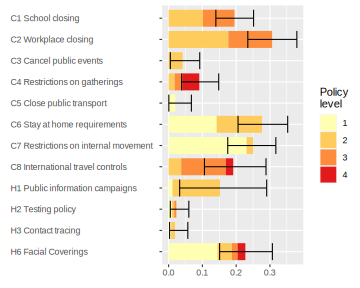
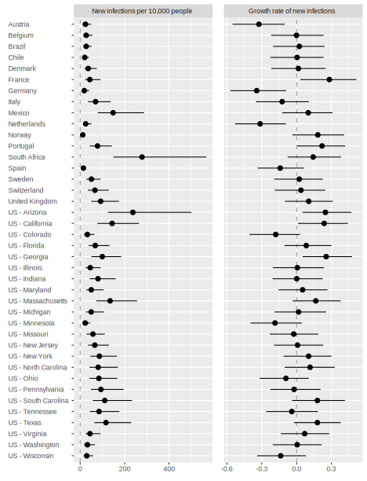
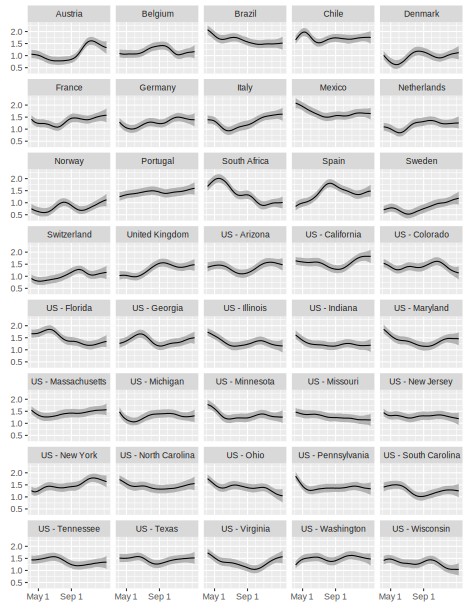

# covid-19projections
Bayesian model to project policy impact of Covid 19 infections.
This repository contains the code to replicate and update the analyses in the paper "Which COVID policies are most effective? A Bayesian analysis of COVID-19 by jurisdiction" by Phebo D. Wibbens, Wesley W. Koo, and Anita M. McGahan, published in PLOS ONE, [https://doi.org/10.1371/journal.pone.0244177].
Please use the release tagged `published` for an exact replication of the charts in the paper.

Below are the latest updates of key figures in the paper.
These charts can be replicated using the `run-model.R` script in the latest commit.

**Fig 1. COVID policy levels by week based on [OxCGRT database](https://github.com/OxCGRT/covid-policy-tracker/blob/master/documentation/codebook.md).** Policies C1-C6; continued in Fig 2.

**Fig 2. COVID policy levels by week based on [OxCGRT database](https://github.com/OxCGRT/covid-policy-tracker/blob/master/documentation/codebook.md).** Policies C7, C8, H1-H3; continued from Fig 1.

**Fig 3. Marginal effect sizes of policy measures on reducing weekly growth rates.**
Bars = median estimate by policy level; Lines = 95% intervals for maximum policy level.

**Fig 4. Weekly rate of new infections and their growth by jurisdiction as of the latest available date.** Dots = median estimates; Lines = 95% intervals.

**Fig 5. Growth rate g(base) after jurisdictions have started to implement one of the base policies (level 1 of C1-C4).** A lower number indicates a higher effectiveness to contain the virus. The total growth rate git of the virus is the number in this chart minus the sum of the effects of implemented policies in Fig 3. Lines = median estimates; Grey bands = 95% intervals.

**Fig 6. Effects of a set of core policies on weekly growth rate g by quantile of g(base) among all jurisdictions.** Core policies include the cumulative effects of C3 - 2, C4 - 3, C6 - 1, C7 - 1, C8 - 3, H1 - 2, H2 - 2, and H3 - 2. Dots = median estimates; Lines = 95% intervals.

**Fig S1. Newly identified COVID cases, COVID deaths, total deaths, and infections per week (log scale).** Dots = reported; X = outlier; Solid lines = model fit; Dashed lines = 95% intervals.

